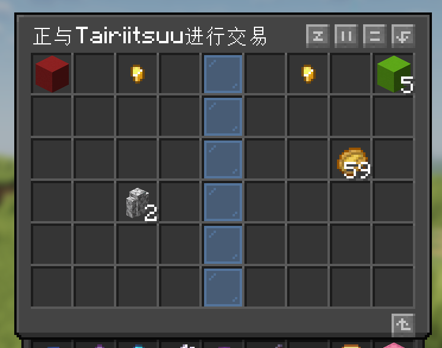
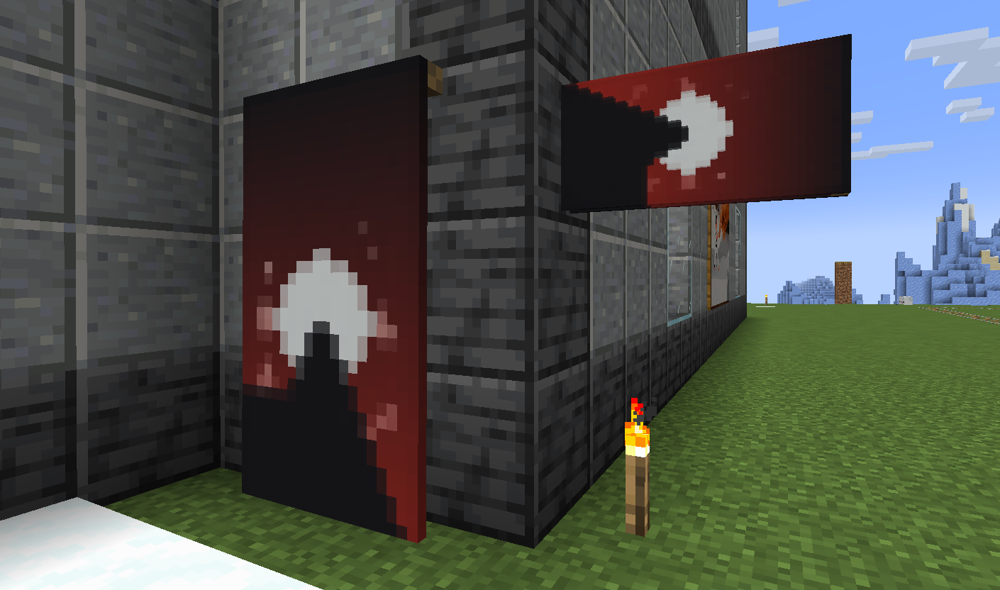

## 服务器功能一览

### 🗺 史莱姆地图

手持粘液球使用（通常是右键）即可打开，可以观察附近何处有史莱姆区块。

### 🔍 COI查询

激活指令：`/co i`，再次输入可退出查询。

激活后左/右键方块可查询该位置的变更记录。

###  🥨变形

变形，就像1.12的变形模组。

#### 快速上手
- **我们强烈建议安装[客户端模组](https://modrinth.com/mod/feathermorphclient)，可以极大提升你的使用体验。**
- 伪装可通过击杀生物获得
    - 玩家伪装通过击杀和交换请求都可以获得
    - 交换请求指令：`/request`
- 若安装了*客户端模组*：
    - 按下 `N` 键可打开变形菜单，左键选择，右键取消
    - 默认按 `方向右（→）` 切换自身可见
    - 按 `方向下（↓）` 取消伪装
    - 按 `V` 可激活技能
- 若未安装*客户端模组*：
    - 使用 `/morph` 指令可以选择要使用的伪装
    - 使用 `/unmorph` 解除伪装
    - 手持羽毛 `潜行+使用` 可以激活技能

### 🌭 游戏特性

当前有以下这些特性：

- 岩浆遇水在y0以下会生成深板岩或深板岩圆石

- **对珊瑚、甘蔗和小型花使用骨粉可能会发生意想不到的事情**

- **带有忠诚附魔的三叉戟被扔进虚空时会触发附魔效果并返回到所有者的身上（如果处于同一世界）**

- 监守者在出现时会在屏幕上生成一个对应的血条

- 末影龙死亡时永远会生成一个龙蛋，无论是否为复活的龙。

- **使用鸡蛋对生物按下鼠标右键（使用物品），即可将生物装进蛋中。**

- 矿车行驶在金块、铁块上的速度会比其他方块更快一些

### 🖊 盔甲架编辑器

用燧石右键空气可打开选项界面，点击选项后关闭界面并与盔甲架互动来应用。

### 📦 城镇/领地

请查看[城镇插件入门](TownyWiki.md)

### 💺 坐下、躺下和趴下

- 使用`/sit`原地坐下，使用`/lay`原地躺下，使用`/crawl`原地趴下
- 空手和一些方块交互（通常是鼠标右键）也可以在该处坐下

### ♠️ 徽章（前缀）

可以通过服务器限时活动等方式来获取免费的徽章。

徽章也可通过资助获得，详情请见资助目录。

### 大地图
访问 `map.xiamomc.ink` 可以查看我们的大地图

你可以在这里实时观察服务器里的情况

### 💴 交易

你可以通过以下方式来和其他玩家交易：

#### 实时交易
*假定你的`潜行`和`使用物品/放置方块`的按键绑定没有改绑*

通过`Shift`+`右键`别人或者`/trade <玩家名>`来发起实时交易

在左侧放入你想提供的物品，点击左侧的金粒可以设定你想提供给对方的瓶盖数量。

右侧则是是对方提供的物品和瓶盖。

如果交易可以达成，那么点击左上角的混凝土即可表示同意，若双方都同意，则经过一定时间后交易达成。

#### 小卖铺

通过`/ah`或传送门访问，使用`/ah sell <价格>`可以售出物品。

售出后将会在市场上展示一段时间可供他人购买，而后会进入回收站

### 旗帜特性

右键墙上的旗帜可以右键堆叠，堆叠后会变大变高，潜行时还可以将他横过来放到墙上！

### 一键整理

- Shift+左键箱子或背包中的空格位可以激活一键整理

### 📅 每日签到

使用`/rewards`可打开签到菜单。

通过签到可以获取一定数额的 瓶盖（服务器货币） 和一些物资补给。

### ✈ 随机传送、家、和`/back`

使用`/rtp`可传送到一定范围内的随机地带，冷却时间10分钟。

如果找到了心仪的地方，可以用`/sethome <name>`来设置一个家。

使用`/back`可以前往上次死亡或传送前的位置。

### 其他功能
- 使用`/fpvp`可以切换自身的PVP状态
